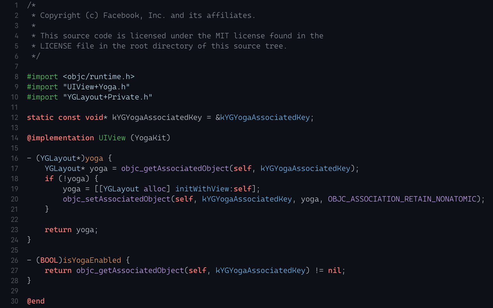

# Xcode Github Theme

Ported version of [github-vscode-theme](https://marketplace.visualstudio.com/items?itemName=GitHub.github-vscode-theme)

- Dark & Light theme

## Install

- Exit Xcode
- Run `install.sh`
- Open Xcode and select `Github (Dark)` or `Github (Light)` theme

Enjoy it.
